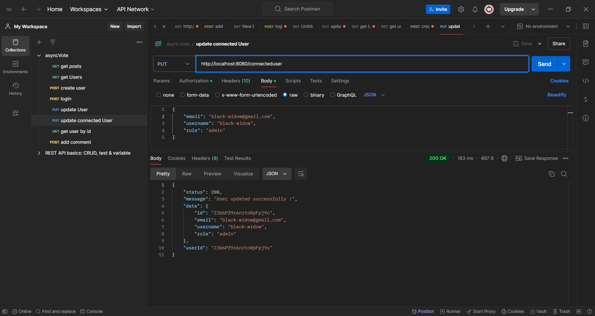

<!-- update user -->

<!-- update connected user -->
En utilisant la route '/users/me', postman pense que le '/me' est un id donc il execute la méthode updateUser. J'ai changé l'url à '/connecteduser' pour que ça fonctionne

