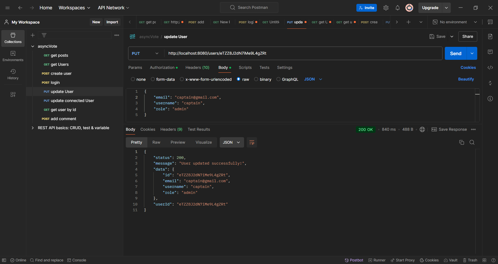
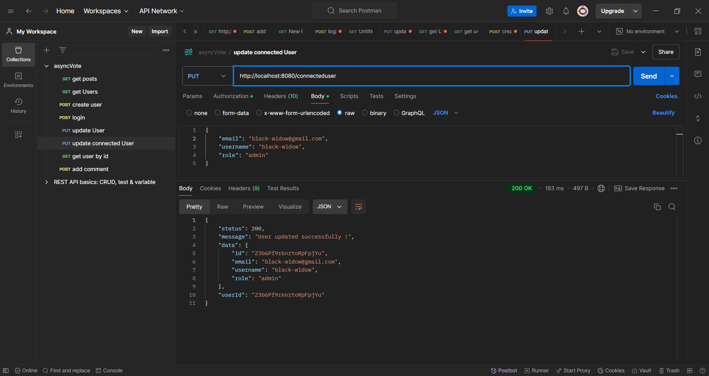
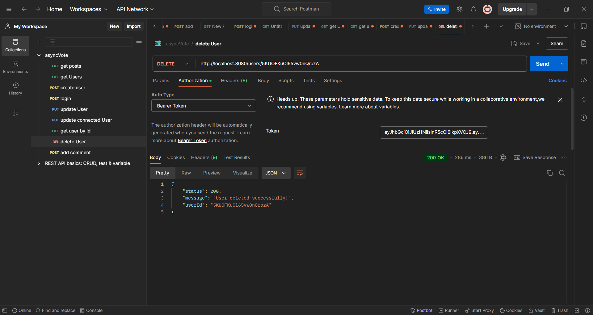
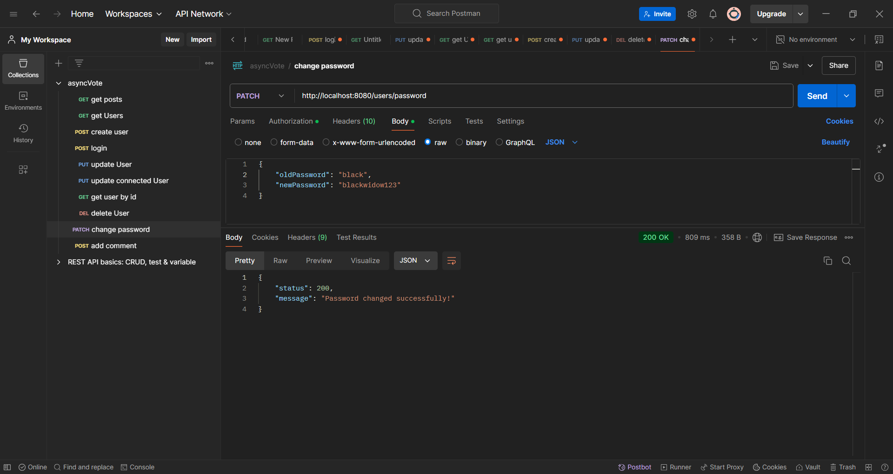
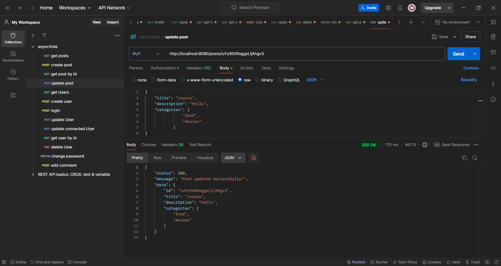
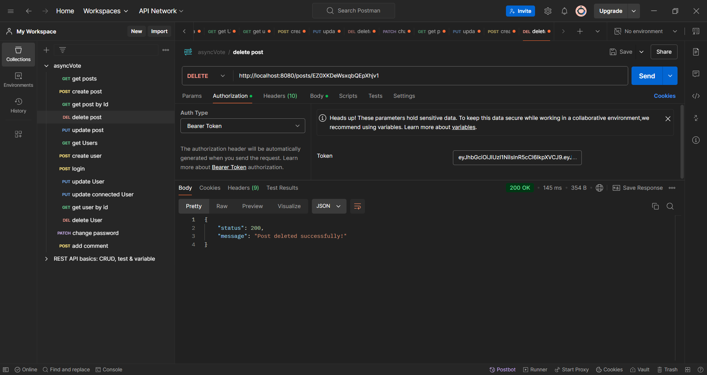
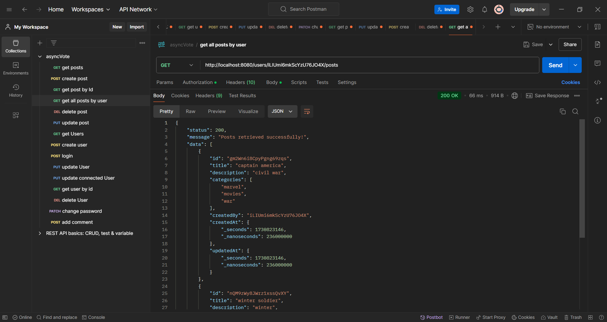

# update user : 

j'ai ajouté le fichier 'authorize.ts' pour donner l'accès à l'admin seulement d'executer cette méthode.

# update connected user :
En utilisant la route '/users/me', postman pense que le '/me' est un id donc il execute la méthode updateUser. J'ai changé l'url à '/connecteduser' pour que ça fonctionne

# login :
Si l'e-mail est incorrect, il m'affiche User not found,
si le mot de passe est incorrect, il m'affiche Password Incorrect

# delete user :
si le role n'est pas admin, il est interdit de supprimer l'user
 

# change password :
La fonction vérifie l'ancien mot de passe et demande de saisir un nouveau.
si l'ancien mot de passe est incorrect, la fonction ne s'execute pas :

mot de passe changé :

login après la modification du mot de passe :

La fonction ne s'execute pas si on saisit pas l'ancien ou le nouveau mot de passe :

# update post :
Seulement le propriétaire du post ou l'admin peuvent modifier le post 
 

# delete post
Seulement le propriétaire du post ou l'admin peuvent supprimer le post 

 

# get all posts by user
Récupérer tous les posts crées par un utilisateur précis
